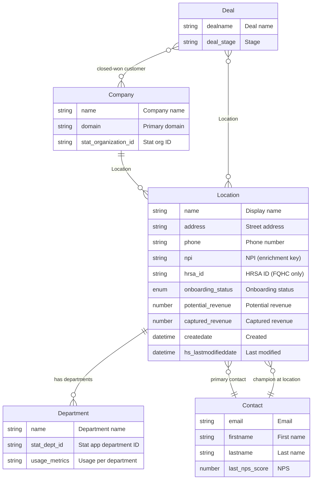

# Location & Department — Entity Relationship Diagram

> Custom object family replacing parent-child Company structure with **Location** (customer site) and future **Department** (per-site).  
> **Note:** An existing **Sites** custom object (`2-56022093`) exists with only `site_name` and `site_id`. Decide whether to migrate/consolidate or run Location in parallel; this ERD assumes the new **Location** object.
>
> **Phase 1 HubSpot ERD (this build-out):** **`docs/location-phase1-erd.md`** — objects, properties, and associations for Phase 1 only.
>
> **Canonical process:** `docs/location-process-and-decisions.md` — deal close → API → Slack review → webhook (one Location per NPI); Deal ↔ Location.

---

## 1. Entity Relationship Diagram



**Cardinality summary**

| Relationship | From | To | Cardinality | When / Notes |
|--------------|------|-----|-------------|--------------|
| Company → Location | Company | Location | 1 : 0..n | One company has many sites (locations). |
| Location → Department | Location | Department | 1 : 0..n | Phase 3: one location has many departments. |
| Location → Contact (primary) | Location | Contact | n : 1 | Primary contact for the site. |
| Contact → Location (champion) | Contact | Location | n : n | Phase 2: association label "Champion at happy location" for NPS-driven intros. |
| Deal → Company | Deal | Company | n : 1 | Closed-won deal links to customer company. |
| Deal ↔ Location | Deal | Location | n : n | Which locations on this deal; which deals this location is on. See `docs/location-process-and-decisions.md` §2. |

---

## 2. Object Definitions

### 2.1 Location (Phase 1+)

| Attribute | Value |
|-----------|--------|
| **Object Name** | Location |
| **Singular / Plural** | Location / Locations |
| **Primary Display Property** | `name` |
| **Purpose** | One physical site of a customer (replaces parent-child company as “site”). |

**Phase 1 properties (core)**

| Property | Internal Name | Type | Required | Source | Description |
|----------|---------------|------|----------|--------|-------------|
| Name | `name` | string | Yes | CS / workflow | Display name (e.g. "Main Campus", "Clinic – Downtown"). |
| Address | `address` | string | No | Mimi Labs | Street address. |
| Phone | `phone` | string | No | Mimi Labs | Site phone number. |
| NPI (enrichment key) | `npi` | string | No | CS | 10-digit NPI for Mimilabs; universal for FQHCs and non-FQHCs. |
| HRSA ID (FQHC only) | `hrsa_id` | string | No | CS | Optional; FQHC-only tracking. Not used for Mimilabs. |
| Onboarding Status | `onboarding_status` | enumeration | No | CS | Set when CS creates record at close. |
| Potential revenue | `potential_revenue` | number | No | CS / deal | Rolled up to Company. |
| Captured revenue | `captured_revenue` | number | No | CS / billing | Rolled up to Company. |

**Phase 2:** Add more fields (e.g. time zone, region, site type); automate creation + Mimi Labs enrichment with human-in-the-loop verification.

**Associations**

| From | To | Cardinality | Label / Notes |
|------|-----|-------------|----------------|
| Company | Location | 1 → many | Location / Parent (primary parent). |
| Location | Contact | many → 1 | Primary contact (single). |
| Deal | Location | many ↔ many | Location / Deal — which locations on deal; which deals for location. Phase 1. |
| Contact | Location | many ↔ many | Phase 2: "Champion at happy location" (NPS-driven). |

---

### 2.2 Department (Phase 3)

| Attribute | Value |
|-----------|--------|
| **Object Name** | Department |
| **Singular / Plural** | Department / Departments |
| **Primary Display Property** | `name` |
| **Purpose** | Department within a Location; usage tracked via Stat app. |

**Planned properties**

| Property | Internal Name | Type | Source | Description |
|----------|---------------|------|--------|-------------|
| Name | `name` | string | Stat / manual | Department name. |
| Stat Department ID | `stat_dept_id` | string | Stat app | Link to Stat app data. |
| Usage (or similar) | TBD | number / string | Stat app | Usage per department; exact property TBD. |

**Associations**

| From | To | Cardinality |
|------|-----|-------------|
| Location | Department | 1 → many |

---

## 3. Phased Rollout Summary

| Phase | What | How | Who |
|-------|------|-----|-----|
| **Phase 1** | Simple location data only: address, phone, primary contact. No departments. | When deal closed, CS creates Location and sets onboarding status + NPI. Mimi Labs enriches core fields from NPI. | Customers only; start with ~10 customers, then expand. |
| **Phase 2** | More fields on Location. | Automate Location creation and Mimi Labs enrichment with human-in-the-loop verification. | Broader customer base. |
| **Phase 2** | Champion intros. | New association label: Contact ↔ Location “Champion at happy location,” driven by NPS survey; used for CS intros. | Happy locations only. |
| **Phase 3** | Departments + usage. | Stat app data → Department records; usage per department and per location. | Locations with Stat data. |
| **Phase 3** | Happy customers ↔ prospects. | Process to surface happy customers (and their locations/contacts) connected to sales prospects. | Sales + CS. |

---

## 4. Data Flow (Phase 1)

Deal closes (Closed Won) → **workflow** triggers **API** (all locations for company) → array (NPI × address × phone × location type) → **CS reviews in Slack** → **webhook** creates **Location** records (one per NPI), associates to Company and optionally to Deal. See `docs/location-process-and-decisions.md` §1.

```mermaid
sequenceDiagram
    participant Deal
    participant Workflow
    participant API
    participant Slack
    participant CS
    participant Webhook
    participant HubSpot as HubSpot CRM
    participant Mimi as Mimi Labs

    Deal->>Workflow: Deal closes (Closed Won - Onboarding)
    Workflow->>API: Get all locations for Company
    API->>Workflow: Array: NPI, address, phone, location type
    Workflow->>Slack: Send array for review
    CS->>Slack: Review and submit
    Slack->>Webhook: Submit (cleaned array)
    Webhook->>HubSpot: Create Location records (one per NPI), associate Company and Deal
    HubSpot->>Mimi: NPI available
    Mimi->>HubSpot: Enrich address, phone, etc.


## 5. Relationship to Existing Objects
- **Company:** Remains the parent "account." Parent-child company structure is replaced by Company → Location (one company, many locations).

- **Deal:** Closed-won deal → same Company. **Deal ↔ Location** (many-to-many): locations created in batch at close; associate selected locations to the deal; location can be on multiple deals. See `docs/location-process-and-decisions.md` §2.
- **Contact:** Primary contact per location (Location → Contact). Later, Contact ↔ Location with “Champion at happy location” for NPS-driven intros.
- **Sites (existing):** Custom object `2-56022093` with `site_name`, `site_id`. If Location is the long-term model, plan migration or deprecation of Sites; otherwise document when to use Sites vs Location.

---

## 6. HubSpot Implementation Notes

1. **Create custom object:** Location with properties above; primary display = `name`.
2. **Create association:** Company → Location (one-to-many).
3. **Create association:** Location → Contact (many-to-one for primary contact).
4. **Create association:** Deal ↔ Location (many-to-many); labels Location / Deal.
5. **Phase 2:** Add association type Contact ↔ Location with label “Champion at happy location.”
6. **Phase 3:** Create Department object and Location → Department association; define Stat sync for departments and usage.
7. **Workflows / integration:** (Phase 1) Deal closed → API → Slack review → webhook creates Location records; ensure Deal has correct Company. See `docs/location-process-and-decisions.md` §1, §3.

Reference: `.cursor/hubspot-context/hs-schema.md` for existing properties and `.cursor/hubspot-context/hs-pipeline.md` for deal stages (e.g. `77f2e34f-14fa-409c-9850-692b7c2c7321` for Closed Won - Onboarding). **Identifiers:** NPI = universal enrichment key (FQHC + non-FQHC); HRSA ID = FQHC-only — see `docs/identifiers-fqhc-non-fqhc.md`.
