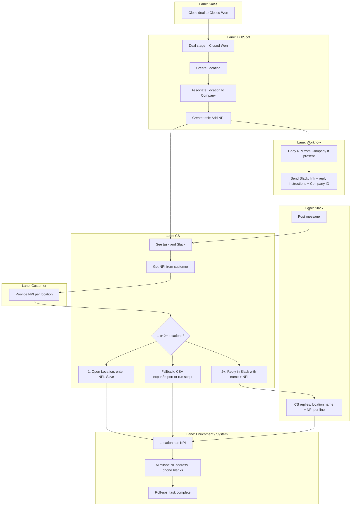

# Location NPI Process — Swim Lane Flow & Inefficiencies

> Flow diagram by **swim lane** (role/system). Inefficiencies are called out in §2 and on the diagram with ⚠️.

---

## 1. Swim lane flow diagram

**Lanes:** Sales → HubSpot → Workflow → Slack → CS → Customer → Enrichment



**Inefficiency markers on the flow:**
- **Slack → Enrichment:** If no bot, Slack reply does not auto-update HubSpot; someone must run the script (see §2).
- **CS (1 location):** Multiple clicks (open Company → Locations → Location → enter NPI).
- **CS (task complete):** If no workflow, CS must remember to mark task complete.

**Sequence diagram (happy path, 2+ locations with Slack bot):**

```mermaid
sequenceDiagram
    participant Sales
    participant HubSpot
    participant Workflow
    participant Slack
    participant CS
    participant Customer
    participant Enrichment

    Sales->>HubSpot: Close deal (Closed Won)
    HubSpot->>Workflow: Trigger: deal stage change
    Workflow->>HubSpot: Create Location, associate, create task
    Workflow->>Slack: Post message (link + reply instructions + Company ID)
    Slack->>CS: Notify
    CS->>Customer: Request NPI(s) once
    Customer->>CS: Provide NPI per location
    CS->>Slack: Reply: location name + NPI (separate lines)
    Slack->>Enrichment: Bot parses reply → script updates HubSpot
    Enrichment->>HubSpot: Set NPI on Location(s)
    Enrichment->>Enrichment: Mimilabs lookup → fill address/phone
    Enrichment->>HubSpot: Roll-ups; task complete
```

---

## 2. Inefficiencies by swim lane

| Lane | Step | Inefficiency | Mitigation |
|------|------|--------------|------------|
| **Slack** | Reply not applied automatically | ⚠️ **Waiting / Motion:** If there is no bot, the Slack reply is just text. Someone must copy it, get Company ID, and run `from-text` script (or paste into a form). Reply “sits” until that happens. | Add Slack app or Zapier/Make that on thread reply calls the script with Company ID from the parent message. |
| **CS** | 1 location | ⚠️ **Motion:** CS still opens HubSpot → Company → Locations → Location → types NPI → Save (multiple clicks). | Accept for single location; keep one link from task to Location to minimize navigation. |
| **CS** | 2+ locations, no Slack bot | ⚠️ **Transport / Motion:** CS may paste Slack reply into a file or script CLI. Context switch (Slack → terminal or file), and Company ID must be found (from Slack message or HubSpot). | Prefer Slack bot. Else: ensure Company ID is in the Slack message body so copy-paste includes it or is one lookup. |
| **CS** | 2+ locations, CSV fallback | ⚠️ **Motion / Overprocessing:** Export Locations → open sheet → fill NPI → save CSV → Import. More steps than Slack reply. | Use Slack reply (or from-text script with pasted text) as primary; document CSV as fallback only. |
| **CS** | Task complete | ⚠️ **Waiting:** If workflow does not auto-complete the task when NPI is set, CS must remember to mark it complete (and may forget after bulk import). | Implement workflow: when Location(s) for the task’s Company have NPI set → mark task complete. |
| **Workflow** | Company ID in Slack | ⚠️ **Defects / Motion:** If Company ID is not in the Slack message, the reply cannot be applied without opening HubSpot to look it up. | Always include Company ID in the message (or in a block value the bot can read). |
| **Enrichment** | Match by location name | ⚠️ **Defects:** Script matches “location name” from Slack to HubSpot Location by name. Typos or different naming (e.g. “Main” vs “Main Campus”) can cause no match or wrong match. | Document that reply names should match HubSpot Location names; script reports “Could not match: X”; consider fuzzy match for minor typos. |
| **Customer** | Doesn’t have NPI | ⚠️ **Waiting / Inventory:** CS must look up NPI by org name (e.g. NPPES) or leave blank; extra step or delayed enrichment. | One-time: document NPPES lookup (e.g. `mimilabs-customer-match.js`); optionally pre-fill from Company NPI when available. |

---

## 3. Summary: highest-impact fixes

| Priority | Inefficiency | Fix |
|----------|---------------|-----|
| 1 | Slack reply not applied automatically | **Slack bot (or Zapier/Make)** that on thread reply runs `from-text` with Company ID from parent message. |
| 2 | Task not auto-completing | **Workflow:** When any Location associated to the task’s Company has `npi` set, mark the task complete. |
| 3 | Company ID missing from Slack | **Workflow:** When sending Slack message, include Company ID in the message body (or in a block the bot reads). |
| 4 | Single-location still multi-click | Keep **single deep link** from task to the Location record (not just Company) when there is exactly one Location. |

---

## 4. References

- **Process:** `docs/location-npi-process.md`
- **Slack format:** `docs/location-npi-slack-format.md`
- **Script (from-text):** `scripts/location-bulk-npi.js`
