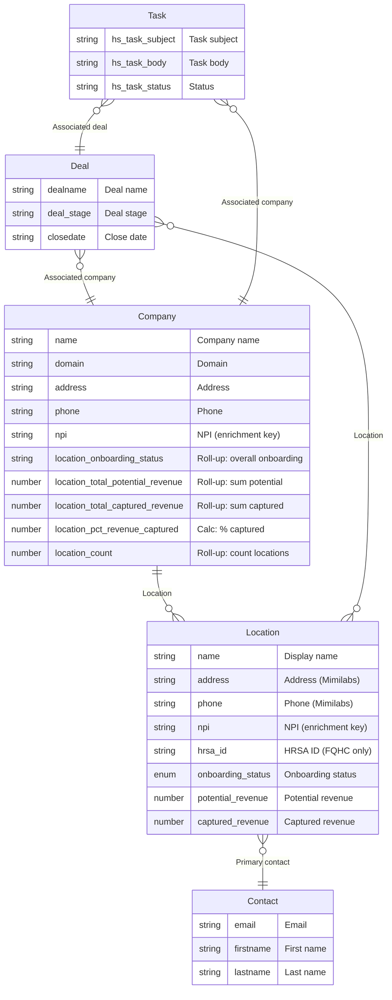

# Phase 1 Architecture — HubSpot ERD

> **Scope:** Phase 1 only. Location custom object, Company roll-ups, Deal as trigger, **Deal ↔ Location** (many-to-many), Contact as primary contact per location. No Department, no "Champion at location" in Phase 1. Canonical process: `docs/location-process-and-decisions.md`.

---

## 1. Entity relationship diagram (Phase 1)

**Cardinality**

| Relationship | From | To | Cardinality | HubSpot association / notes |
|--------------|------|-----|-------------|-----------------------------|
| Company → Location | Company | Location | 1 : 0..n | Custom: **Location** / **Parent** |
| Location → Contact | Location | Contact | n : 1 | Custom: **Primary contact** / **Primary location** |
| Deal → Company | Deal | Company | n : 1 | Standard: Deal’s associated company |
| Task → Deal | Task | Deal | 0..n : 0..1 | Standard: task can be associated to deal |
| Task → Company | Task | Company | 0..n : 0..1 | Standard: task can be associated to company |

**Phase 1 trigger:** Deal moves to Closed Won (Onboarding/Engagement) → workflow triggers **API** (all locations for company) → **CS reviews and submits array in Slack** → **webhook** creates **Location** records (one per NPI), associates to Company and optionally to Deal. See `docs/location-process-and-decisions.md` §1, §2.

---

## 2. Objects in HubSpot (Phase 1)

| Object | Type | Purpose in Phase 1 |
|--------|------|---------------------|
| **Company** | Standard (companies) | Parent account; has Locations; roll-ups for onboarding, revenue, location count. |
| **Location** | Custom | One physical site; NPI, address, phone (Mimilabs), onboarding, revenue; linked to one Company and optionally one Primary contact. |
| **Contact** | Standard (contacts) | Primary contact can be associated to Location (Primary contact / Primary location). |
| **Deal** | Standard (deals) | Closed Won triggers workflow: create Location, create Task. Deal is associated to Company (standard). |
| **Task** | Standard (tasks) | “Add NPI for [Company]”; created by workflow; associated to Deal or Company; link to Company (and reply instructions) in body. |

---

## 3. Custom object: Location (Phase 1 only)

| # | Label | Internal name | Type | Required | Source |
|---|--------|----------------|------|----------|--------|
| 1 | Name | `name` | text | Yes | Workflow / CS |
| 2 | Address | `address` | text | No | Mimilabs |
| 3 | Phone | `phone` | phonenumber | No | Mimilabs |
| 4 | NPI (enrichment key) | `npi` | text | No | CS |
| 5 | HRSA ID (FQHC only) | `hrsa_id` | text | No | CS |
| 6 | Onboarding status | `onboarding_status` | select | No | CS |
| 7 | Potential revenue | `potential_revenue` | number | No | CS / deal |
| 8 | Captured revenue | `captured_revenue` | number | No | CS / billing |

**Primary display property:** `name`.  
**Default properties (do not create):** `createdate`, `hs_lastmodifieddate`, `hs_object_id`.

---

## 4. Company properties used in Phase 1

**Existing (use as-is):** `name`, `domain`, `address`, `phone`, and optionally `npi` if you store org NPI on Company.

**New for Phase 1 (roll-ups / calculated):**

| # | Label | Internal name | Type | How |
|---|--------|----------------|------|-----|
| 1 | Overall onboarding status | `location_onboarding_status` | select | Workflow from Location onboarding_status (worst wins). |
| 2 | Total potential revenue | `location_total_potential_revenue` | number | Roll-up: sum of Location.potential_revenue. |
| 3 | Total captured revenue | `location_total_captured_revenue` | number | Roll-up: sum of Location.captured_revenue. |
| 4 | % of total revenue captured | `location_pct_revenue_captured` | number | Calculated: captured / potential × 100 (guard for zero). |
| 5 | # of locations | `location_count` | number | Roll-up: count of associated Locations. |

---

## 5. Association types (Phase 1)

**Three custom association types.**

| From | To | Label (this object → associated) | Label (associated → this object) |
|------|-----|----------------------------------|----------------------------------|
| Company | Location | **Location** | **Parent** |
| Location | Contact | **Primary contact** | **Primary location** |

**Standard HubSpot associations** (no setup): Deal → Company, Task → Deal, Task → Company.

---

## 6. What is out of scope in Phase 1

| Item | When |
|------|------|
| Department object | Phase 3 |
| Contact ↔ Location “Champion at happy location” | Phase 2 |
| Location: fax, city/state/zip, time zone, site type | Later phases |
| Company: NPI as required field | Optional; add `npi` on Company if you enrich Company from Mimilabs. |

---

## 7. Reference: HubSpot implementation

- **Location object + 8 properties:** Create in Settings → Data Management → Objects → Location.
- **Company roll-up/calculated properties:** Create in Settings → Properties → Company; configure roll-ups and calculated property.
- **Association types:** Create in Settings → Data Management → Associations; use labels above.
- **Workflow:** Deal stage = Closed Won (Onboarding/Engagement) → create Location, associate to Company, create Task, send Slack (see `docs/location-npi-process.md`).

**Docs:** `docs/location-mvp-architecture.md`, `docs/location-process-and-decisions.md`, `docs/location-erd.md`, `.cursor/hubspot-context/hs-schema.md`, `.cursor/hubspot-context/hs-pipeline.md`.
